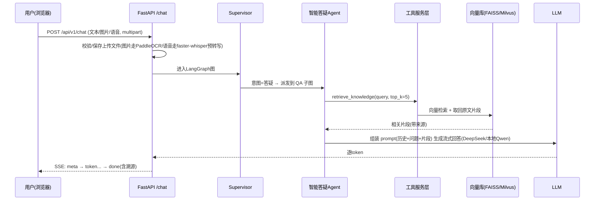
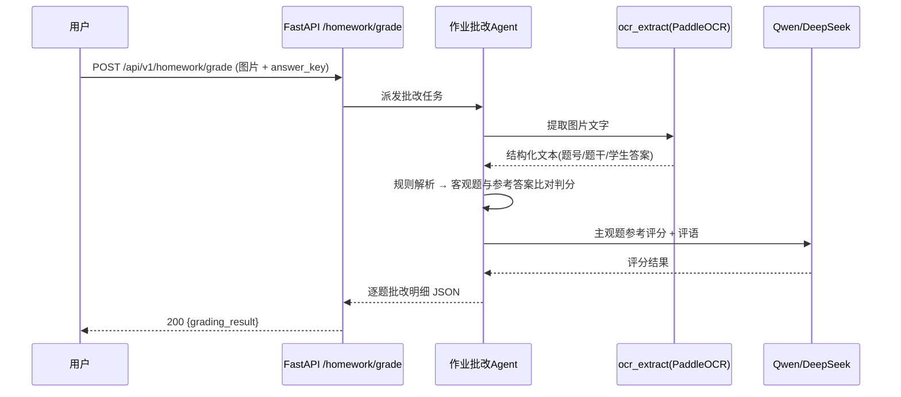
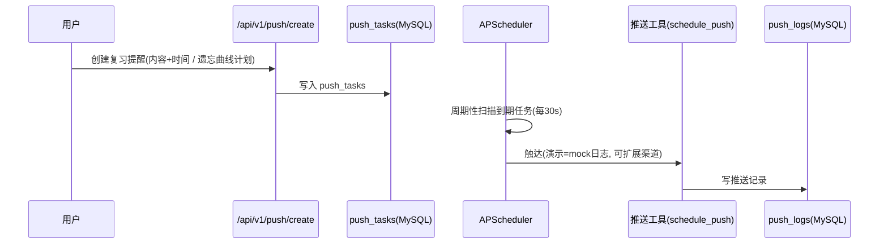

# 系统架构设计

> 配套文档：`00-项目总览.md`（技术基线）· `05-Agent编排设计.md`（图编排细节）· `06-工具服务层设计.md`（工具细节）· `03-数据库设计.md`（存储细节）。

## 1. 术语对照表（重要，先读）

`项目介绍.md` 中的架构名词在本项目中的**落地形态**如下。AI coding 时请按此对照：

| 原始架构名词 | 本项目落地实现 | 说明 |
|--------------|----------------|------|
| **Function Call 决策层** | LangGraph 的 **Supervisor 路由节点**：LLM 工具调用做意图分类，分派到子 Agent | 决策逻辑由 LLM 函数调用 + 图路由完成 |
| **MCP 工具服务层** | `app/tools/` 下的一组**带 JSON Schema 的 Python 工具函数**（LangChain `@tool`） | 可选：用 `FastMCP` 封装成标准 MCP Server（见 `06` §6） |
| **A2A 协作层** | LangGraph **状态图**实现的多 Agent 编排（Supervisor 模式 + 共享状态 + 子图调用） | A2A 协议概念的轻量等价实现 |
| **Milvus 2.3（向量库）** | **生产**：连接已部署的 Milvus 实例；**开发**：FAISS | `VectorStore` 接口 + `VECTOR_BACKEND` 切换 |
| **Redis 7.2（缓存）** | **生产**：连接已部署的 Redis；**开发**：内存 TTL 缓存 | `Cache` 接口 + `CACHE_BACKEND` 切换 |
| **MySQL 8.0（业务库）** | **MySQL 8.0**（开发本机实例；生产连接已部署实例） | 全期一致 |
| **Qwen-plus（推理）** | **开发**：DeepSeek 云 API `deepseek-v4-flash`；**生产**：本地 Qwen（Ollama） | `LLM_PROVIDER` 切换，OpenAI 兼容 |
| **4×A10 GPU 服务器 / T4** | 笔记本（开发）+ 实验室 Ubuntu RTX 4090（生产） | 生产本地模型用 4090 推理 |
| **PaddleOCR 2.6 / Whisper-large-v3** | PaddleOCR（CPU，可 GPU）+ faster-whisper `small`（可 GPU） | 保留本地多模态 |

## 2. 架构分层

```
┌─────────────────────────────────────────────────────────────┐
│ 表现层（Presentation）                                        │
│   FastAPI 静态单页 (app/static/index.html) + SSE 流式交互      │
├─────────────────────────────────────────────────────────────┤
│ 应用层（API / Application）                                   │
│   app/main.py · app/api/* 路由 · app/schemas 参数校验          │
├─────────────────────────────────────────────────────────────┤
│ 编排层（Orchestration / 决策层）                              │
│   app/agents/supervisor.py —— LangGraph 图 + LLM 工具调用      │
│   子 Agent 子图：qa / grading / mistake / exercise / push      │
├─────────────────────────────────────────────────────────────┤
│ 工具服务层（Tool / Service）                                  │
│   app/tools/* —— @tool 函数（OCR/ASR/检索/评分/出题/推送）      │
│   app/services/* —— llm 工厂、RAG 编排、OCR/ASR、调度器        │
├─────────────────────────────────────────────────────────────┤
│ 数据访问层（Data Access）                                     │
│   app/storage/ —— MySQL(SQLAlchemy) · VectorStore(FAISS/Milvus)│
│                    · Cache(内存/Redis) · 仓储(Repository)      │
└─────────────────────────────────────────────────────────────┘
```

依赖方向**自上而下单向**：API → 编排 → 工具/服务 → 数据访问。禁止反向 import（详见 `08-开发规范与编码约定.md`）。

## 3. 组件职责

### 3.1 编排层：Supervisor 与子 Agent

- `app/agents/supervisor.py`：构建 LangGraph `StateGraph`。根节点是 **决策节点**（LLM 带工具选择子 Agent），再分派到对应子 Agent 子图；完成后结果写回共享 State，最终汇到 END。
- 每个子 Agent 是**独立的 LangGraph 子图**。详细定义见 `05-Agent编排设计.md`。

### 3.2 工具服务层：可复用能力

- OCR（`ocr_extract`）、语音转写（`speech_to_text`）、知识检索（`retrieve_knowledge`）、客观题判分（`grade_objective`）、出题（`generate_exercise`）、推送（`schedule_push`）、知识点分类（`classify_knowledge_point`）。
- 每个工具是 `@tool` 装饰的函数。详见 `06-工具服务层设计.md`。

### 3.3 数据访问层（后端可切换）

- `db.py`：SQLAlchemy `engine` / `SessionLocal`（MySQL，连接串 `DATABASE_URL`）。
- `models.py`：ORM 模型（表结构见 `03-数据库设计.md` §4）。
- `vector_store.py`：`VectorStore` 接口 + `get_vector_store()` 工厂（FAISS / Milvus 两实现）。
- `cache.py`：`Cache` 接口 + `get_cache()` 工厂（内存 TTL / Redis 两实现）。
- `repositories/`：每张核心表一个 Repository，**只依赖 MySQL + 接口**，业务层不感知后端。

## 4. 关键数据流

### 4.1 智能答疑链路（含多模态）



### 4.2 作业批改链路



### 4.3 学习推送链路（后台）



## 5. 部署拓扑（双模式）

### 5.1 开发期（笔记本 Windows）

```
┌────────────────────────── 笔记本（Windows 11） ─────────────────────────┐
│                                                                          │
│  uvicorn 进程（Python 3.11）                                              │
│   ├─ FastAPI + 静态前端          :8000                                    │
│   ├─ LangGraph 编排 + LLM(云端 DeepSeek) + Embedding(云端千问)            │
│   ├─ PaddleOCR(CPU)  ← 惰性加载单例                                       │
│   ├─ faster-whisper small/int8(CPU) ← 惰性加载单例                        │
│   ├─ APScheduler 后台定时任务                                              │
│   └─ 存储：MySQL(本机) + FAISS(data/vector_index) + 内存TTL缓存           │
│                                                                          │
│  外网：api.deepseek.com / dashscope.aliyuncs.com（OpenAI 兼容）          │
└──────────────────────────────────────────────────────────────────────────┘
```

### 5.2 生产期（实验室 Ubuntu + RTX 4090）

```
┌────────────────────── Ubuntu 服务器（RTX 4090 24GB） ────────────────────┐
│                                                                          │
│  中间件（已部署实例，应用只配置连接）                                       │
│   ├─ MySQL :3306   (业务库)                                               │
│   ├─ Redis :6379   (缓存)                                                 │
│   ├─ Milvus :19530 (向量库；其内部对象存储 MinIO 与应用无关)               │
│                                                                          │
│  Ollama（本地模型，RTX 4090 推理）                                        │
│   ├─ qwen2.5:14b           对话/决策 LLM   :11434/v1（OpenAI 兼容）      │
│   └─ bge-m3                 向量 Embedding（1024 维）                    │
│                                                                          │
│  uvicorn 进程（同一台机或单独进程）:8000                                  │
│   ├─ FastAPI + 静态前端 · LangGraph 编排                                  │
│   ├─ PaddleOCR / faster-whisper（可用 GPU 加速）                         │
│   └─ 存储：MySQL + Milvus + Redis（全企业级）                            │
└──────────────────────────────────────────────────────────────────────────┘
```

要点：

- **同一套代码**跑两种拓扑，差异仅在 `.env`（`LLM_PROVIDER`/`EMBEDDING_PROVIDER`/`VECTOR_BACKEND`/`CACHE_BACKEND`）。迁移见 `07` §9。
- 生产中间件（MySQL/Redis/Milvus）**已部署时直接连接**；若目标机未预装，可用根目录 `docker-compose.prod.yml`（可选/备用）一键起 MySQL+Redis+Milvus(+etcd+minio)。
- PaddleOCR 与 faster-whisper 采用**进程级单例 + 惰性加载**：首次调用时才初始化。
- 生产 4090 也可将 PaddleOCR / faster-whisper 切到 GPU（显存 24GB 富余）。

## 6. 模块依赖边界

| 模块 | 允许依赖 | 禁止依赖 |
|------|----------|----------|
| `app/api/*` | schemas, agents, services | tools 直接调用、storage 直接操作（应经 services/agents） |
| `app/agents/*` | tools, services, storage(repositories) | 直接访问 HTTP/前端 |
| `app/tools/*` | services, storage | api 层 |
| `app/services/*` | storage, core | api, agents |
| `app/storage/*` | core, models | 其他层 |

> 约定：路由只做「参数校验 + 调编排层 + 序列化」，业务逻辑一律下沉到 agents/services。**任何业务模块不得直接 import `faiss` / `pymilvus` / `redis` / `pymysql` 后端库**，只能经 `services`/`storage` 暴露的接口。
