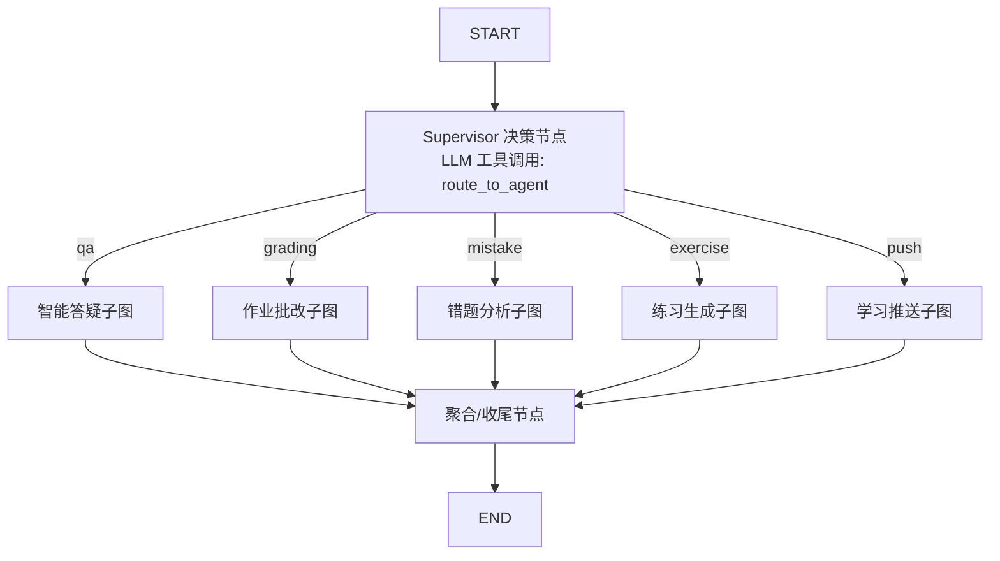
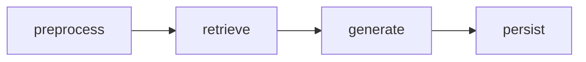

# Agent 编排设计（LangGraph）

> 配套文档：`00-项目总览.md`（技术基线）· `02-系统架构设计.md`（编排层）· `06-工具服务层设计.md`（工具细节）。
> 代码位置：`app/agents/`：`supervisor.py` + 5 个 Agent 模块。

## 1. LangGraph 版本差异（重要）

本项目采用**最新稳定版 LangGraph/LangChain**（2026 年），与 `项目介绍.md` 指定的旧版（LangGraph 0.0.45 / LangChain 0.1.17）API 有显著差异。编码时统一使用：

```python
from langgraph.graph import StateGraph, START, END
from langgraph.graph.state import CompiledStateGraph
from langgraph.prebuilt import ToolNode

from langchain_core.messages import HumanMessage, AIMessage, SystemMessage, ToolMessage
from langchain_openai import ChatOpenAI
from langchain_core.tools import tool
```

差异速查：

| 能力 | 旧版（0.1.x/0.0.45） | 新版（最新） |
|------|----------------------|--------------|
| 状态图 | `StateGraph(state_schema)` + `graph.add_node/add_edge` | 同左（核心 API 稳定），`START`/`END` 从 `langgraph.graph` 导入 |
| Agent 循环 | 手写 `agent` + `tools` 循环 | `langgraph.prebuilt.create_react_agent`（可选）或手写 ToolNode |
| 流式 | `.stream()` | `.astream()` / `.astream_events()` |
| 模型绑定工具 | `bind_tools(tools)` | 同左（`langchain_openai.ChatOpenAI`） |

> **原则**：以上面代码块为准。若运行时报导入错误，以 `pip show langgraph` 实际版本查官方文档修正，不要回退旧版写法。

## 2. 整体图结构



- **Supervisor** 是「决策 + 路由」节点：把用户意图分类为 5 类之一（含「无法识别/闲聊」回落到 qa）。
- 每个子 Agent 是**独立的 `StateGraph` 子图**，用 `add_node` 挂进主图。
- 共享状态 `AppState` 在子 Agent 执行间传递。

## 3. 共享状态定义（`app/agents/state.py`）

```python
from typing import TypedDict, Optional, Any

class AppState(TypedDict):
    user_id: int
    conversation_id: Optional[int]
    query: str                     # 用户原始输入（文本）
    attachments: list[dict]        # [{type: image|audio, path: str}] 附件
    history: list[dict]            # 最近 N 轮对话 [{role, content}]
    task: str                      # 意图分类结果: qa|grading|mistake|exercise|push
    # --- 各子 Agent 的输出 ---
    qa_result: dict                # {answer, source_refs}
    grading_result: dict           # 批改结果
    mistake_result: dict
    exercise_result: dict
    push_result: dict
    error: Optional[str]
```

> 简化约定：每个子 Agent 只写自己的 `*_result` 字段；聚合节点统一打包成对外响应。

## 4. Supervisor 决策节点（`supervisor.py`）

**思路**：Qwen 绑定一个 `route_to_agent` 工具，由 LLM 判断意图并返回分类；图根据该分类条件路由到对应子图。

```python
from langchain_core.tools import tool
from langchain_openai import ChatOpenAI

@tool
def route_to_agent(intent: str) -> str:
    """判断用户请求属于哪个教育任务。
    intent 取值：
    - qa: 知识问答/讲解/多模态提问
    - grading: 作业/试卷批改、判分
    - mistake: 错题录入、错题分析、薄弱点
    - exercise: 出题、练习题、组卷
    - push: 提醒、复习计划、推送
    """
    return intent

SYSTEM_PROMPT = """你是 EduMentor 的任务调度器。
请阅读用户输入与附件，用 route_to_agent 工具选择最合适的教育任务类别。
只调用一次工具，不要执行任务本身。"""

_VALID_TASKS = {"qa", "grading", "mistake", "exercise", "push"}

def supervisor_node(state: AppState, llm: ChatOpenAI) -> AppState:
    messages = [SystemMessage(content=SYSTEM_PROMPT), HumanMessage(content=state["query"])]
    resp = llm.bind_tools([route_to_agent]).invoke(messages)
    intent = _extract_tool_arg(resp)          # 解析 tool_call 参数 intent
    state["task"] = intent if intent in _VALID_TASKS else "qa"  # 未知意图兜底到答疑
    return state
```

**图构建**：

```python
def build_graph() -> CompiledStateGraph:
    g = StateGraph(AppState)
    g.add_node("supervisor", supervisor_node)
    g.add_node("qa", qa_subgraph())      # 子图以 node 形式挂载
    g.add_node("grading", grading_subgraph())
    g.add_node("mistake", mistake_subgraph())
    g.add_node("exercise", exercise_subgraph())
    g.add_node("push", push_subgraph())
    g.add_node("aggregate", aggregate_node)

    g.add_edge(START, "supervisor")
    g.add_conditional_edges("supervisor",
        lambda s: s["task"],                      # 路由函数（supervisor_node 已保证 task 合法）
        {"qa": "qa", "grading": "grading", "mistake": "mistake",
         "exercise": "exercise", "push": "push"}) # 未知意图已在决策节点归一化为 qa
    for name in ("qa", "grading", "mistake", "exercise", "push"):
        g.add_edge(name, "aggregate")
    g.add_edge("aggregate", END)
    return g.compile()
```

## 5. 各子 Agent 设计

通用要点：

- 每个子 Agent 提供 `build_subgraph() -> StateGraph` 与 `run(state) -> state` 的封装函数。
- **LLM 封装统一走 `app/services/llm.py` 工厂**：`get_chat_llm()` 按 `LLM_PROVIDER` 返回 DeepSeek（开发）/ 本地 Qwen（生产），`get_embedding_client()` 按 `EMBEDDING_PROVIDER` 返回千问 / 本地 `bge-m3`。子 Agent 只调用工厂，不关心具体提供商。
- 节点函数内**不直接 import 工具实现**，而是调用 `app/tools/` 暴露的函数（职责边界见 `02-系统架构设计.md` §6）。

### 5.1 智能答疑子图（`qa_agent.py`）

**节点序列**：`preprocess → retrieve → generate → persist`



| 节点 | 职责 | 关键调用 |
|------|------|----------|
| `preprocess` | 附件处理：图片→`ocr_extract`，音频→`speech_to_text`，结果并入 `query`；取历史 | `ocr_extract` / `speech_to_text` / conversation_repo |
| `retrieve` | 对 query 向量化 + FAISS 检索 top_k=5 | `retrieve_knowledge` |
| `generate` | 组装 prompt（系统指令 + 历史 + 相关片段）→ Qwen **流式**生成 | `get_chat_llm().astream()` |
| `persist` | 保存 user/assistant 消息与溯源；写回 `state["qa_result"]` | message_repo |

**RAG Prompt 草稿**（`app/services/rag_service.py`）：

```text
你是 EduMentor 智能答疑助手，面向学习大模型/Agent 的大学生，基于提供的知识库片段回答问题。
规则：
1. 只依据【知识库片段】回答；片段不足以作答时，明确说“知识库中未找到该内容”。
2. 回答需给出解释，语言简洁、通俗，适合初学大模型的大学生理解。
3. 不要编造知识库中不存在的事实。
【历史对话】
{history}
【知识库片段】
{context}
【学生问题】
{query}
```

### 5.2 作业批改子图（`grading_agent.py`）

**节点序列**：`ocr → parse → grade_objective → grade_subjective → assemble`

| 节点 | 职责 | 关键调用 |
|------|------|----------|
| `ocr` | 图片 OCR 提取文本 | `ocr_extract` |
| `parse` | 把 OCR 文本按题号切分，得到 `[(题号, 题干, 学生答案)]`（规则解析 + 正则） | 本地函数 |
| `grade_objective` | 客观题与 `answer_key` 比对判分 | `grade_objective` |
| `grade_subjective` | 主观题调用 Qwen 给参考评分与评语（标注 `is_ai_scored=true`） | `get_chat_llm()` |
| `assemble` | 汇总 summary + items，落库 | homework_repo |

**主观题评分 Prompt 草稿**：

```text
你是《大模型导论》课程作业批改助手，批改对象为初学大模型的大学生。请根据参考答案，对学生主观题作答给出参考评分(0-100)、一句话评语和改进建议。
只输出 JSON：{"score": 86, "comment": "...", "suggestion": "..."}
【题目】{question}
【参考答案】{reference_answer}
【学生作答】{student_answer}
```

### 5.3 错题分析子图（`mistake_agent.py`）

**节点序列**：`ingest → tag → analyze → explain`

| 节点 | 职责 | 关键调用 |
|------|------|----------|
| `ingest` | 解析错题录入（文本或 OCR 图片），写入 mistakes | `ocr_extract`(若图片) / mistake_repo |
| `tag` | 自动关联知识点：LLM（当前提供商）从 `knowledge_points` 中选最匹配项 | `get_chat_llm()` + knowledge_repo |
| `analyze` | 统计该学生各知识点错误次数 TopN，生成薄弱点归纳文案 | knowledge_repo/mistake_repo + LLM |
| `explain` | 针对单题生成讲解：错误模式、解法、常见错误、变式题 | `get_chat_llm()` |

**讲解 Prompt 草稿**：

```text
你是大模型课程错题讲解老师，面向初学大模型的大学生。请针对下面错题给出：
1. 错误模式分析（概念混淆/理解偏差/原理记忆不清等）
2. 该知识点完整讲解
3. 常见错误清单（最多3条）
4. 一道同类变式练习题
只输出 JSON：{"error_pattern": "...", "explanation": "...", "common_mistakes": [...], "variant": "..."}
【知识点】{knowledge_point}
【题目】{question}
【错误答案】{wrong_answer}
【正确答案】{correct_answer}
```

### 5.4 练习生成子图（`exercise_agent.py`）

**节点序列**：`resolve_template → fill_params → validate → optional_llm_polish`

| 节点 | 职责 | 关键调用 |
|------|------|----------|
| `resolve_template` | 按知识点/题型/难度查模板（exercises 表） | exercise_repo |
| `fill_params` | 程序化填参：按 `params_schema` 从知识点标准陈述库选取（含**答案自洽校验**：正确项唯一、干扰项不重复） | 本地函数 |
| `validate` | 校验题面可解、难度达标（可调用 LLM 复核） | `get_chat_llm()`（可选） |
| `polish` | 用 LLM 润色题目表述与生成解析（保证不超纲、语句通顺） | `get_chat_llm()` |

**参数化示例**（存 `exercises.template`，大模型/Agent 领域）：

```text
选择：下列关于{concept}的说法，正确的是（  ）
params_schema: {"concept": ["注意力机制", "Transformer", "RAG", "LoRA", "Function Calling"]}
标准陈述库（程序化保证正确性，答案唯一可解）：
  "注意力机制": {
    "correct": "自注意力通过 Q/K/V 三个矩阵计算输入序列中各位置的加权表示",
    "distractors": ["自注意力只能处理单个位置", "Q 与 V 相乘得到注意力权重", "注意力权重不需要归一化"]
  }
  ...
answer_template: "正确项对应选项（程序确定）"
```

> 难度控制：`easy` = 基础概念识别；`medium` = 概念理解与对比；`hard` = 原理推导 / 综合比较（LLM 对同一知识点生成不同深度的题干与解析）。

### 5.5 学习推送子图（`push_agent.py`）

**节点序列**：`parse_plan → persist_tasks`（创建任务）；后台另由调度器执行。

| 节点 | 职责 | 关键调用 |
|------|------|----------|
| `parse_plan` | 解析「直接时间」或「遗忘曲线计划」(1/2/4/7天) | 本地函数（间隔规则） |
| `persist_tasks` | 写入 `push_tasks` | push_repo |

**遗忘曲线规则**：`review_intervals = [1, 2, 4, 7]`（天）；从起始日每天 09:00 触发。

**后台调度**（`app/services/scheduler.py`，独立于图）：

```python
from apscheduler.schedulers.asyncio import AsyncIOScheduler

def scan_due_tasks():            # 每 30s 触发
    tasks = push_repo.list_pending_due(now=now_utc())
    for t in tasks:
        ok = schedule_push(t)    # 渠道分发（mock 写日志）
        push_repo.log_result(t, ok)
```

## 6. 图与 API 的接线（`app/main.py` 侧）

```python
# app/main.py（示意）
from app.agents.supervisor import build_graph
from app.core.config import settings

graph = build_graph()

@app.post("/api/v1/chat")
async def chat(...):
    # 1. 保存上传文件、解析请求 -> AppState
    # 2. 用 graph.astream(state) 消费流式事件
    #    在 generate 节点内通过 yield 产出 SSE token 事件
    # 3. 聚合节点完成后产出 done 事件
```

> 流式实现的推荐做法：子图 `generate` 节点内部用 `llm.astream()` 逐 token 输出，并通过**回调/共享队列**把 token 推向 SSE 生成器；前端逐 token 渲染。Demo 也可降级为整段返回（去掉流式）以降低复杂度——`04-API接口设计.md` 的 SSE 事件格式保持不变。

## 7. 状态持久化（可选）

- 演示默认**不启用** LangGraph 持久化（checkpoint 存会话）。
- 对话历史持久化由业务层 `conversations/messages` 表（MySQL）完成（跨请求），图内 `history` 只承载当次上下文。
- 如需图级持久化：LangGraph 官方提供 `InMemorySaver` / `PostgresSaver`；本项目 MySQL 场景可直接用 `InMemorySaver`（单进程）或在需要时引入 `PostgresSaver`，**不引入 SQLite checkpoint**。
